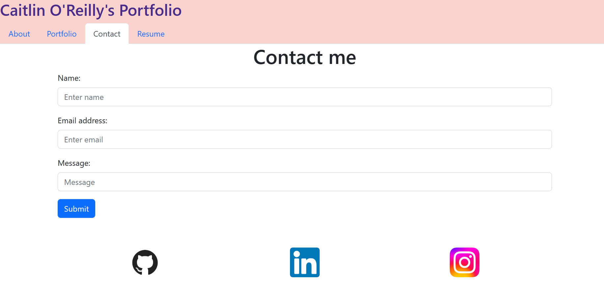

# react-portfolio

## Description

--- 

This React Portfolio is a single-page application portfolio created using React. The portfolio contains a header, a footer, navigation tabs, an about section, a portfolio section, a contact section, and a resume section. The portfolio section contains screenshots and descriptions of completed projects, as well as links to their corresponding GitHub repositories and deployed applications. The resume section contains a downloadable PDF of my resume. The footer contains links to my GitHib, LinkedIn, and Instagram accounts. For further information, please view my GitHub repository [here]()and deployed application [here]()for this React project! 

## Table of Contents

--- 

- [Technologies](#technologies)
- [Screenshot](#screenshot)
- [Questions](#questions)

## Technologies

---

The following technologies were necessary to install for this web application:

- React
- React-bootstrap
- React-dom
- Bootstrap (for React)

In the project directory, you can run "npm start" which runs the app in the development mode. This will open [http://localhost:3000](http://localhost:3000) in your browser. The page will reload when you make changes.

## Screenshot

---

This image displays the Contact page on the React Portfolio webpage.

.

## Questions

---

If you have any questions about this project, please feel free to contact me directly via email at coreilly29@gmail.com.
You can also view my additional projects at https://github.com/caitoreilly.

